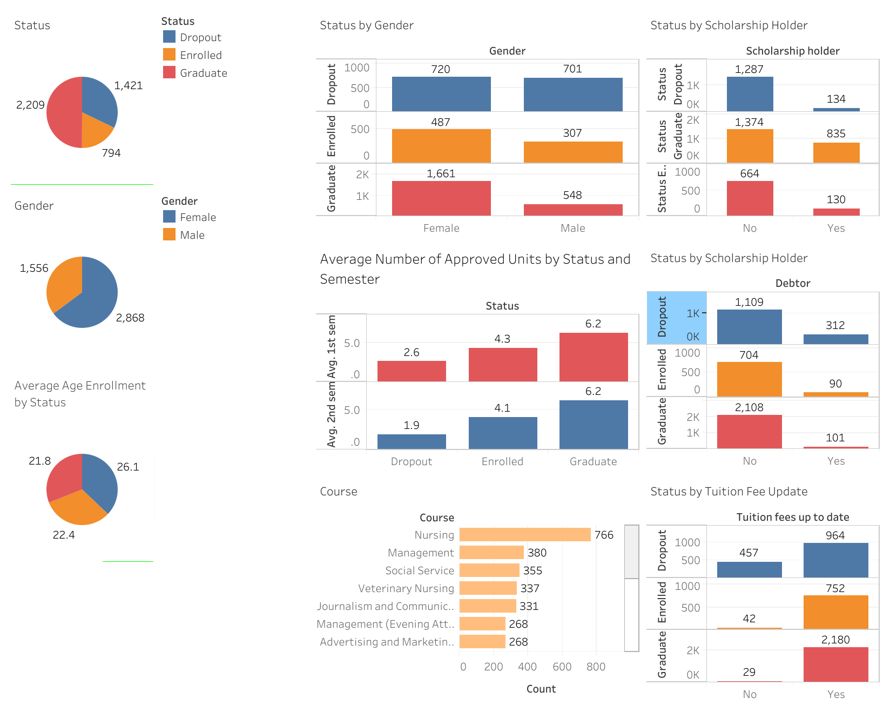

# Proyek Akhir: Menyelesaikan Permasalahan Institusi Pendidikan

## Business Understanding
**Jaya Jaya Institut** merupakan salah satu institusi pendidikan perguruan tinggi yang telah berdiri sejak tahun 2000. Hingga saat ini, Jaya Jaya Institut telah mencetak banyak lulusan dengan reputasi yang sangat baik. Akan tetapi, masih terdapat banyak mahasiswa yang tidak menyelesaikan pendidikannya alias dropout.

Jumlah dropout yang tinggi ini menjadi salah satu masalah besar bagi institusi pendidikan, karena dapat memengaruhi reputasi kampus, kualitas akademik, dan juga finansial institusi. Oleh karena itu, **Jaya Jaya Institut ingin mendeteksi secepat mungkin mahasiswa yang berpotensi melakukan *dropout*** sehingga mereka dapat diberikan bimbingan khusus, pendampingan akademik, atau dukungan lainnya untuk meningkatkan peluang keberhasilan studi.

Dengan memanfaatkan data mahasiswa yang mencakup informasi sejak awal pendaftaran (demografi, latar belakang akademik, dan kondisi sosial-ekonomi), serta performa akademik pada semester pertama dan kedua, institusi dapat membangun **sistem prediksi berbasis machine learning** untuk mengklasifikasikan mahasiswa ke dalam tiga kategori:iga kategori:

- **Dropout** (berhenti sebelum menyelesaikan studi),
- **Enrolled** (masih aktif terdaftar),
- **Graduate** (berhasil menyelesaikan studi).

Dengan adanya sistem prediksi ini, Jaya Jaya Institut bisa melakukan intervensi lebih awal terhadap mahasiswa berisiko, sehingga dapat menekan angka dropout dan meningkatkan tingkat kelulusan.

### Permasalahan Bisnis
1. Faktor apa saja yang paling berpengaruh terhadap status akhir mahasiswa (dropout, enrolled, graduate)?
2. Bagaimana cara mendeteksi mahasiswa yang berisiko dropout sejak awal studi?
3. Apakah performa akademik pada semester pertama dan kedua bisa menjadi indikator kuat untuk memprediksi kelulusan mahasiswa?
4. Bagaimana visualisasi data dapat membantu dosen wali dan manajemen dalam memantau potensi dropout mahasiswa?
5. Model machine learning apa yang paling efektif untuk memprediksi status mahasiswa di Jaya Jaya Institut?

### Cakupan Proyek
Proyek ini akan mencakup:
1. **Eksplorasi dan preprocessing data** untuk memahami hubungan faktor demografi, akademik, dan sosial-ekonomi dengan status akhir mahasiswa.
2. **Feature engineering & modeling** → membangun model klasifikasi machine learning untuk memprediksi status akhir mahasiswa (dropout, enrolled, graduate).
3. **Pembuatan business dashboard** untuk memantau distribusi mahasiswa berdasarkan status akhir dan faktor risikonya.
4. **Deployment prototype** sistem prediksi berbasis web.

### Persiapan
*Data source:** [Student Data](https://github.com/dicodingacademy/dicoding_dataset/tree/main/students_performance 'Dicoding GitHub - Student Dropout')

**Setup environment:**

1. Clone this Repository
   ```bash
   git clone https://github.com/atifa1110/Student-Dropout
   ```

2. Create Python Virtual Environment
   ```bash
   virtualenv venv
   ```

3. Activate the Environment
   ```bash
   venv\Scripts\activate
   ```

4. Install All the Requirements Inside "requirements.txt"
   ```bash
   pip install -r requirements.txt
   ```

## Business Dashboard
Dashboard ini menyajikan distribusi status mahasiswa (dropout, enrolled, graduate) berdasarkan berbagai faktor (gender, beasiswa, utang, biaya kuliah, nilai, dan jurusan). Berikut penjelasan tiap visualisasi:



1. Status (Pie Chart, kiri atas)
- Menampilkan distribusi mahasiswa berdasarkan status akhir:
Dropout: 2,209 mahasiswa, Enrolled: 794 mahasiswa, Graduate: 1,421 mahasiswa
- Insight: jumlah dropout cukup dominan dibandingkan graduate, ini menegaskan permasalahan utama institusi.

2. Gender (Pie Chart, kiri tengah)
- Menampilkan distribusi mahasiswa berdasarkan gender: Female: 2,868, Male: 1,556
- Insight: jumlah mahasiswa perempuan lebih banyak daripada laki-laki.

3. Average Age Enrollment by Status (Pie Chart, kiri bawah)
- Rata-rata usia mahasiswa saat mendaftar: Dropout: 26.1 tahun, Enrolled: 22.4 tahun, Graduate: 21.8 tahun
- Insight: mahasiswa yang lebih tua cenderung lebih sering dropout.

4. Status by Gender (Bar Chart, kanan atas kiri)
- Membandingkan status mahasiswa berdasarkan gender.
- Insight: baik laki-laki maupun perempuan sama-sama memiliki kasus dropout tinggi, tetapi jumlah lulusan perempuan lebih tinggi dibandingkan laki-laki.

5. Status by Scholarship Holder (Bar Chart, kanan atas kanan)
- Menampilkan status mahasiswa berdasarkan kepemilikan beasiswa.
- Insight: mahasiswa penerima beasiswa lebih banyak yang graduate, sedangkan yang tidak menerima beasiswa lebih banyak yang dropout.

6. Average Number of Approved Units by Status and Semester (Bar Chart, tengah kiri)
- Menunjukkan jumlah mata kuliah yang lulus (approved units) rata-rata pada semester 1 & 2.
- Insight: mahasiswa yang graduate memiliki rata-rata unit lulus lebih tinggi (6.2) dibandingkan dropout (sekitar 2.6 di semester 1, 1.9 di semester 2).

7. Status by Debtor (Bar Chart, tengah kanan)
- Menampilkan status berdasarkan kondisi utang mahasiswa.
- Insight: mahasiswa yang memiliki utang lebih cenderung dropout, sementara mahasiswa tanpa utang lebih banyak yang graduate.

8. Course (Bar Chart, bawah kiri)
- Distribusi mahasiswa berdasarkan program studi (contoh: Nursing, Management, Social Service, dsb).
- Insight: jumlah mahasiswa terbesar berasal dari program Nursing. Penting untuk menganalisis apakah jurusan ini juga memiliki tingkat dropout tinggi.

9. Status by Tuition Fee Update (Bar Chart, bawah kanan)
- Menampilkan status berdasarkan keteraturan pembayaran biaya kuliah.
- Insight: mahasiswa yang tidak up-to-date dalam pembayaran biaya kuliah mayoritas dropout, sedangkan yang selalu membayar tepat waktu mayoritas graduate.

📊 Dashboard dapat dipublikasikan di Tableau Public ([Link](https://public.tableau.com/app/profile/atifa.fiorenza/viz/Student_17565759638510/Dashboard1))

## Menjalankan Sistem Machine Learning
Untuk dapat membantu institusi dalam memprediksi kemungkinan jika siswanya akan dropout dan mencegah hal tersebut lebih dini, dapat menggunakan sistem prediksi yang telah dibangun. Sistem dibangun menggunakan Streamlit dan untuk menjalankan sistem tersebut secara local, dapat menjalankan kode berikut pada Terminal

```
python -m streamlit run app.py
```
Dan untuk menghentikan program aplikasi Streamlit dapat melalui ```ctrl + c```.
Sistem prediksi tersebut juga dapat diakses secara langsung yang sudah di-deploy ke Streamlit Cloud melalui tautan [berikut ini.](https://student-dropout-atifa.streamlit.app/)

## Conclusion
- **Faktor utama** yang memengaruhi status mahasiswa adalah usia saat masuk, status pekerjaan, pendapatan keluarga, program studi, serta performa akademik semester pertama dan kedua. 
- **Deteksi dini mahasiswa berisiko dropout** dapat dilakukan dengan model prediksi berbasis machine learning. Model terbaik, **Random Forest**, mencapai akurasi 91.18%, recall 96.6%, dan F1-score 93.0%. Hal ini menunjukkan bahwa sistem mampu secara efektif mengidentifikasi mahasiswa yang berisiko dropout sejak awal.
- Performa akademik mahasiswa, khususnya pada semester 2, terbukti menjadi salah satu indikator terkuat dalam memprediksi status akhir mahasiswa.
- **Dashboard interaktif** yang dibangun mendukung dosen wali dan manajemen dalam memantau distribusi mahasiswa berdasarkan status dan faktor risiko dropout.
- **Random Forest terpilih sebagai model terbaik** dibandingkan empat model lainnya, karena memberikan hasil evaluasi paling tinggi di hampir semua metrik.

### Rekomendasi Action Items
1. Implementasi Early Warning System (EWS)
- Gunakan model prediksi Random Forest (akurasi 91.18%, recall 96.6%) untuk mendeteksi mahasiswa yang berisiko dropout sejak semester awal.
- Hasil prediksi ini bisa ditampilkan ke dosen wali melalui dashboard.

2. Program Intervensi Akademik
- Mahasiswa dengan performa akademik rendah di semester 2 perlu diarahkan ke program bimbingan belajar, tutoring tambahan, atau remedial khusus.
- Hal ini karena performa semester 2 terbukti sebagai indikator paling kuat terhadap kelulusan.

3. Dukungan Finansial & Administratif
- Berdasarkan analisis, mahasiswa yang memiliki utang atau tidak membayar biaya kuliah tepat waktu lebih rentan dropout.
- Institut dapat menyediakan beasiswa darurat, cicilan biaya kuliah yang fleksibel, atau konseling keuangan.

4. Beasiswa & Insentif Retensi
- Mahasiswa penerima beasiswa menunjukkan tingkat kelulusan lebih tinggi. Oleh karena itu, jumlah beasiswa bisa diperluas dengan syarat performa akademik terjaga.
- Berikan insentif akademik/non-akademik bagi mahasiswa yang konsisten berprestasi untuk meningkatkan motivasi.

5. Monitoring Real-Time melalui Dashboard
- Dashboard interaktif digunakan untuk memantau distribusi status mahasiswa (dropout, enrolled, graduate) serta faktor risiko.
- Dosen wali dan pihak manajemen dapat menggunakan dashboard ini untuk segera menghubungi mahasiswa yang terdeteksi berisiko.